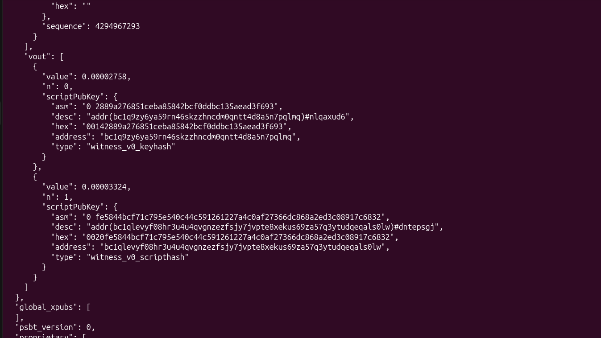
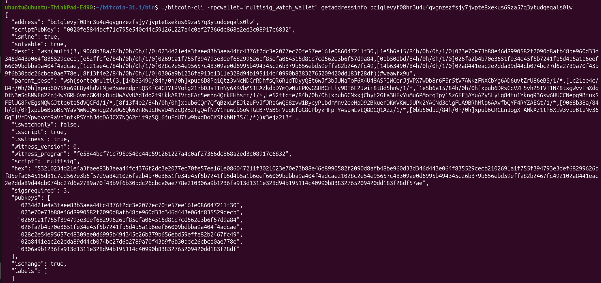
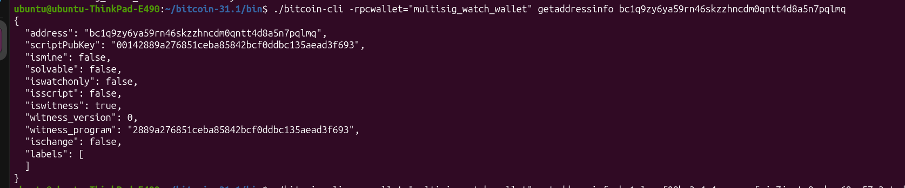

# Verify the output addresses of a PSBT

Verifying the output address of a PSBT is a prudent security step when signing a PSBT generated by your online computer. The reason for this is because there is a small chance that malware could infect the online machine used to generate your transaction. An attacker could swap out either the destination address or the change address in your transaction with their own address, stealing some or all of your funds. 

Verifying a PSBT is not a necessary step when doing your test transactions during initial setup, because the change amount is very small, however this extra precaution is worth taking anytime you are signing a PSBT with larger amounts of money in the wallet.

Note: If you are moving the entire contents of the wallet with a single transaction (sweeping all of the funds in one go), you only need to verify the destination address. There will not be a change address to verify because there will not be any change for your wallet to receive back.


## Decoding a PSBT

To verify the outputs of a PSBT, you must have the psbt file on the desktop of the computer. You must have the `multisig_watch_wallet` in the `~/.bitcoin/wallets` folder (Remember: A copy of `multisig_watch_wallet` can be found on any of your backup discs. **Never insert these discs into your online computer**).

Once you have the `multisig_watch_wallet` imported to the proper location, ensure Bitcoin Core has started by running this command in the terminal:

```
~/bitcoin-31.1/bin/bitcoind -daemon
```

Then ensure you have the `multisig_watch_wallet` loaded by running this command:

```
~/bitcoin-31.1/bin/bitcoin-cli loadwallet "multisig_watch_wallet"
```

Now you can decode the unsigned PSBT contents with this command on the \*offline computer\*:

```
~/bitcoin-31.1/bin/bitcoin-cli decodepsbt "$(cat ~/Desktop/unsigned.psbt)"
```

Or decode the signed PSBT contents with this command on the online computer:

```
~/bitcoin-31.1/bin/bitcoin-cli decodepsbt "$(cat ~/Desktop/signed.psbt)"
```


## Verifying Outputs

In order to verify the contents of our PSBT there are two things we must check:

1. The `destination_address` and `amount` that you provided when you created the transaction.

2. The `change_address` and that it belongs to your wallet (There will not be a change output/address if you are moving all of the funds out of the wallet).

To verify these two pieces of information we need to look for the `vout` (vector of outputs) section of the JSON, it will look something like this:



As you can see in the photo this PSBT contains two different outputs (`n:0` and `n:1`), one is the destination output and one is the change output (the left over BTC that gets sent back into our own wallet).

Within an output, you are looking for the `address` and the `value` field. Assuming you can remember how much BTC you are sending and to what address, you can compare these two outputs to determine which is the destination output and which is the change output. 

If the `address` and `value` do not match what you expect for the destination output, **STOP! DO NOT PROCEED! Re-evaluate the above steps. An attacker may be trying to steal your funds.**

Once you have identified the change output, you should then run the following command in the terminal (replacing `$change_address` with the actual change address obtained from the output) to verify that it belongs to your wallet:

```
~/bitcoin-31.1/bin/bitcoin-cli -rpcwallet="multisig_watch_wallet" getaddressinfo "$change_address"
```

In the result of this command you need to look for `"ismine": true`, this confirms that the change address belongs to your wallet.



If `"ismine": false` appears on your change address **STOP! DO NOT PROCEED! Re-evaluate the above steps. An attacker may be trying to steal your funds.**

There is no need to run `getaddressinfo` on the `destination_address`, however, for reference, if you were to run the address query on the `destination_address`, rather than the `change_address`, like so:

```
~/bitcoin-31.1/bin/bitcoin-cli -rpcwallet="multisig_watch_wallet" getaddressinfo "$destination_address"
```

This is an example of what you would expect to see:



Notice the `ismine: false`.

If you query both addresses in both of the outputs and neither of them return `ismine: true`. **STOP! DO NOT PROCEED! Re-evaluate the above steps. An attacker may be trying to steal your funds.**


## [\*offline computer\*] Unload the watch wallet after you are finished verifying

After you finish decoding and verifying your PSBT, on the \*offline computer\*, you should first unload the `multisig_watch_wallet` prior to signing the PSBT. This will prevent any potential errors from occurring with the signing script.

```
~/bitcoin-31.1/bin/bitcoin-cli unloadwallet multisig_watch_wallet
```

